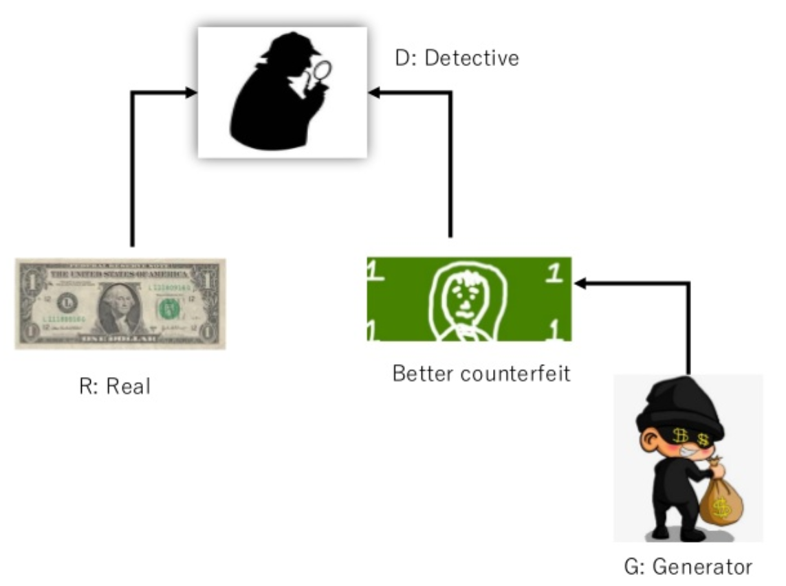
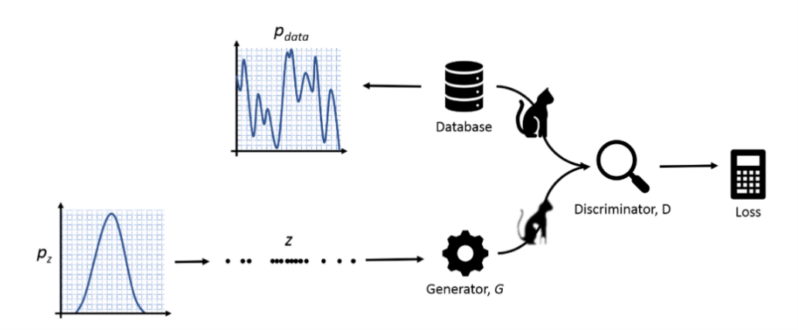
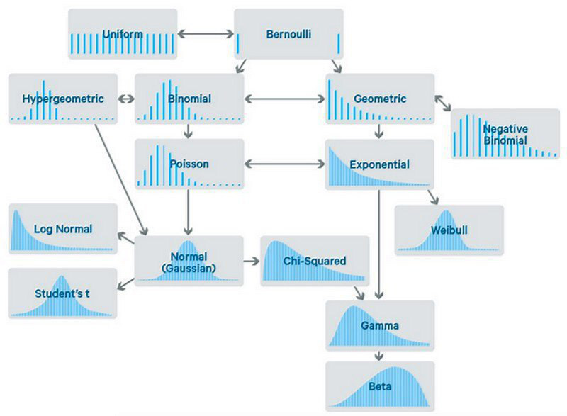
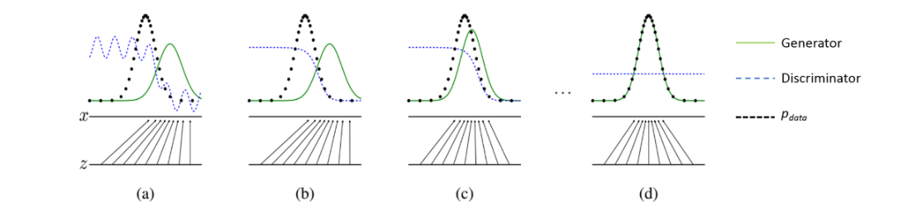
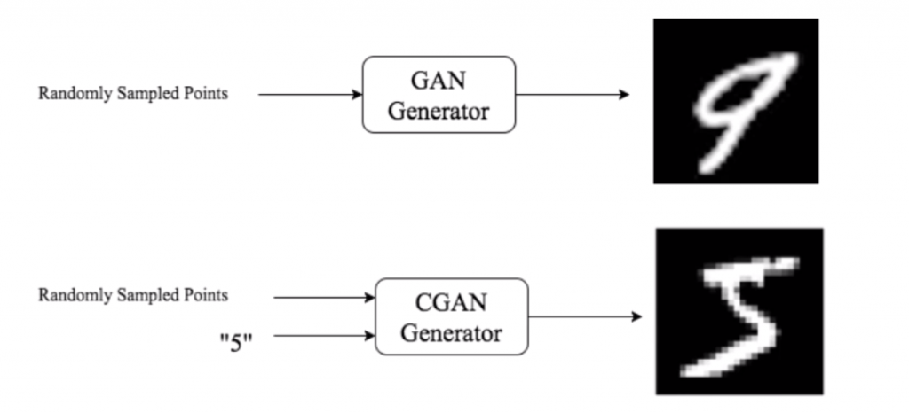

### شبکه های مولد متخاصم Generative Adversarial Networks
شبکه های مولد متخاصم با استفاده از معماری شبکه های عصبی کانولوشنی قادرند تا از مجموعه ای از تصاویر (دیتاست) یاد بگیرد و تصاویری مشابه تصاویر واقعی اما کاملاً جدیدی که در دیتاست موجود نیست را تولید کند. این شبکه برای اولین بار توسط IanGoodfellow معرفی شد.
   
   

**اجزای اصلی شبکه GAN:**
  
دو جزء اساسی در GAN وجود دارد که سعی در بهبود شبکه برخلاف یکدیگر دارند:

*مولد:* تولید کننده که با خلق تصاویر بسیار نویزدار از دیتای ورودی که اغلب بصورت نویز گوسی به شبکه داده می شود کار خود را شروع می نماید. وظیفه ای که مولد باید در ادامه انجام دهد این است که تصاویری، تا حد ممکن حقیقی تولید کند که به اندازه ی کافی طبیعی جلوه کنند.

*تمیز دهنده:* تشخیص دهنده که وظیفه آن، تشخیص تصاویر حقیقی از تصاویر جعلی است. بدین صورت که با نگاه کردن به تصاویر تولیدی از مولد باید تشخیص دهد که تصاویر به اندازه ی کافی طبیعی جلوه می کنند یا خیر. این وظیفه را با مقایسه ی بین تصاویر دیتاست و تصاویر تولید شده توسط مولد انجام می دهد.
مولد (تولید کننده) را به اختصار G و تمیز دهنده(تشخیص دهنده) را نیز D می نامیم.

بنابراین در Generative Adversarial Networks ، هدف آن است که تصاویری ایجاد کنیم که به اندازه¬ی تصاویر حقیقی، طبیعی جلوه کنند. به طوری که نه تنها قادر به فریب انسان باشد، بلکه قادر به فریب کامپیوتری که خود آنها را تولید کرده نیز باشد.

همواره برای توضیح شبکه های مولد متخاصم از مثال جاعل G و کارآگاه D نام برده می شود. بدین صورت که جاعل اسکناس برای اولین بار اسکناسی را جعل می نماید و آن به طریقی به دست کارآگاه می رساند. کارآگاه آن را با اسکناس حقیقی مقایسه می نماید و متوجه میشود که اسکناس جعلی است. او به همکاران خود گزارش می دهد و به این ترتیب جاعل از لو رفتن اسکناس تولیدی خود مطلع می گردد. جاعل پس از آن سعی در بهبود اسکناس های جعلی می نماید. برای تلاش بعدی دوباره اسکناس جعلی بهبود داده شده را به طریقی به دست کارآگاه می رساند. کارآگاه که از دفعه ی پیش تجربه کسب کرده بود با دقت بیشتری به بررسی آن می پردازد و سعی در بررسی بیشتر ظرافات موجود در اسکناس می نماید. بدین ترتیب کارآگاه دوباره به جعلی بودن اسکناس پی می برد. این کار تا زمانی تکرار می گردد که جاعل اسکناسی به اندازه ی کافی شبیه به اسکناس حقیقی تولید نماید که کارآگاه متوجه جعلی بودن اسکناس نگردد. پس از آن اسکناس های جعلی را به بازار عرضه می نماید.
در شبکه های مولد متخاصم، مولد همان جاعل است و تمیز دهنده همان کارآگاه است که وظیفه ی تشخیصی مهمی را بر عهده دارد.

فرض کنید تصویری داریم که تمیز دهنده D در حال آنالیز آن است. اگر تصویر به نظر نرمال یا طبیعی باشد، D مقداری نزدیک به ۰ به آن می دهد و اگر تصویر به نظر غیر طبیعی (غیرحقیقی) باشد مقداری نزدیک به ۱ (می تواند برای مثال تصاویر بسیار نویز دار باشد) به آن می دهد. مولد G، بردار Z را از تصاویر رندوم نمونه برداری شده ی ساده، بطور مثال توزیع نرمال یا توزیع یکنواخت که شناخته شده اند، دریافت و سعی در تولید تصویری حقیقی می کند.

تصاویری که توسط مولد G تولید شده اند باید به تمیز دهنده ی D بروند تا به فرایند آموزش تابع موجود در تمیز دهنده D کمک کند. ما به تناوب به تمیز دهنده D تصاویر حقیقی موجود در دیتاست را نشان می دهیم (که پارامتر هایش را تغییر خواهد داد تا مقدار کم، نزدیک به صفر را به خروجی دهد) و سپس تصویر تولیدی از مولد G(که پارامتر های تمیز دهنده D را تغییر خواهد داد و مقدار بالاتر، نزدیک به ۱ را به خروجی می دهد). در همین زمان ما از مولد G می خواهیم تا همزمان یاد بگیرد و تصویر واقعی تری که قادر به فریب دادن تمیز دهنده D باشد را تولید کند. ما می خواهیم مولد G مقدار خروجی تمیز دهنده D را کمینه کند درحالی که تمیز دهنده D سعی در بیشینه کردن آن دارد. در حقیقت آنها یک بازی بیشینه کمینه در برابر یکدیگر انجام می دهند. در اینجاست که واژه ی متخاصم موجود در GAN معنی خود را کامل می کند.

این نوع شبکه ها متغیرهای پنهان بسیاری دارند که نیاز به بررسی است. برای درک بهتر می توانیم از ورودی شروع نماییم که از توزیع نرمال استفاده کنیم. همانطور که در شکل بالا مشخص است، آن را با Pz نشان دادیم و بصورت رندوم یک بردار برای آن در نظر می گیریم. با توجه به اینکه توزیع موجود در دیتاست را نمی دانیم آن را با Pdata نشان دادیم. مولد G با توجه به توزیع احتمال ورودی سعی در تولید تصویری حقیقی دارد که بتواند تمیز دهنده ی D را فریب دهد (Pg). هدف این است که تقریبا Pdata = Pg گردد.

در حقیقت Pz یک توزیع نرمال از تابع توزیع احتمال می باشد. مانند شکل زیر:
تصویر سمت چپ توزیع نرمال از تابع توزیع احتمال است و شکل سمت راست نمونه ای از تابع توزیع احتمال نرمال می باشد. رابطه ی کلیدی بین تصویر و آمار چیزی است که ما را قادر می سازد تا تصاویر را به عنوان نمونه هایی از یک تابع توزیع چند بعدی تفسیر نمائیم.
در تصویر زیر توزیع های مختلف موجود در علوم داده نشان داده شده است.

بنابراین در GAN هدف این است که:
مقدار خروجی تمیز دهنده وقتی که تصویر از Pdata باشد، کمینه گردد و در غیرِ این صورت بیشینه باشد؛
(G((z) D بیشینه باشد و (G((z) 1- D کمینه باشد؛

مزیت استفاده از شبکه ی عصبی این است که به راحتی می توان مشتق ها را محاسبه نمود و از انتشار به عقب جهت آموزش شبکه و تصحیح وزن دهی و … استفاده نمود.
در آن واحد تنها یک شبکه مورد آموزش قرار می گیرد، ابتدا یک شبکه (مولد G یا تمیز دهنده ی D) را آموزش می دهیم و بعد از آموزش آن شبکه، وزن شبکه ی آموزش دیده را ثابت نگه می داریم و شبکه ی دیگر را آموزش می دهیم ( تمیز دهنده ی D یا مولد G).

روند آموزش شبکه ی GAN ؛ Pg توزیع تصویر تولید شده توسط مولد G است که با رنگ سبز و توزیع تصویر دیتاست، با رنگ سیاه و همچنین تمیز دهنده D را با رنگ آبی نشان دادیم.

  

a) تصاویر تولیدی توسط مولد به تصاویر دیتاست شباهت چندانی ندارد.
  
b) وزن دهی تمیزدهنده به روز رسانی شده است در حالی که وزن دهی مولد ثابت مانده است
 
c) وزن دهی مولد به روز رسانی شده درحالی که وزن دهی تمیزدهنده ثابت نگه داشته شده است.
 
d)  و Pg و Pdata بسیار شبیه به هم شدند.
  

 

**برای GAN دو کاربرد عمده وجود دارد:**

1- تولید تصاویر جدید براساس دیتا های آموزش دیده موجود در دیتاست.

2- ترمیم تصویر؛ که ممکن است بخشی از تصویر حذف و یا مسدود شده باشد.

در مسئله ی ترمیم تصویر فرض بر این است که تصویری داریم و می خواهیم کمبود و نقایص موجود در تصویر را برطرف کنیم، این کار را با جایگزینی آن با تصویرِ زمینه انجام می دهیم. فرض کنید یک تصویر از یک تعطیلات دوست داشتنی از یک صحنه ی زیبا دارید امّا یک سری افرادی که نمی شناسید نیز در تصویر وجود دارند و باعث از بین رفتن منظره شده اند. برای برطرف کردن این ناهماهنگی در تصویر ممکن است از نرم افزار Photoshop استفاده کنیم. در اینجا دو انتخاب داریم؛ انتخاب اول این است که اگه مشابه تصویر را در دسترس داریم از آن تصویر برای بازسازی بخش مورد نیاز استفاده کنیم. که در اینصورت باید به کل تصویر نگاه کنیم و تصویر متناسب با مفهوم تصویر را برای جایگزینی انتخاب کنیم و یا به عنوان انتخاب دوم اگر مشابه تصویر در دسترس نباشد، تنها راه برای پر کردن قسمت مورد نظر این است که از پیکسل های همسایه برای پرکردن ناحیه ی مسدود شده استفاده کنیم و یا اگر بیش از حد دقت داشته باشیم، ممکن است از بخش های مشابه موجود در همان تصویر استفاده کنیم.

روش اول اصطلاحاً روش مبتنی بر درک و روش دوّم اصطلاحاً روش مبتنی بر محتوا نامیده میشوند.

در شبکه های مولد متخاصم ورودی شبکه ی مولد، نویز گوسی است و ورودی های شبکه ی تمیزدهنده تصاویر تولیدی توسط مولد و تصاویر موجود در دیتاست می باشند.
شبکه ی مولد در ابتدا با در اختیار داشتن نویز، تصویری جعلی تولید می نماید. این تصویر به تمیزدهنده می رود. اگر تمیز دهنده تشخیص دهد تصویر تولیدی توسط مولد به میزان کافی حقیقی است، تصویر به خروجی شبکه داده می شود و کار تمام است. اما اگر تمیزدهنده با مقایسه با تصاویر موجود در دیتاست، تصویر را جعلی تشخیص دهد فیدبک به مولد داده می شود تا وزن های خود را بروزرسانی نماید که در نتیجه مولد تصویری حقیقی تر را تولید می نماید و این پروسه تا جایی ادامه می یابد که شبکه ی تمیزدهنده متوجه جعلی بودن تصویر خروجی از مولد نشود.

#### انواع شبکه های Generative Adversarial Networks:

1- شبکه های مولد متخاصم وانیلا ( شبکه ی اصلی معرفی شده توسط ایان گودفلو) (The Vanilla GAN)

 
2- شبکه های مولد متخاصم عمیق کانولوشنی (Deep Convolutional Generative Adversarial Networks)

استفاده از شبکه های عصبی کانولوشنی استفاده شده در یادگیری بدون ناظر هم در مولد و هم در تمیز دهنده.

برای مثال در شبکه ی توسعه داده شده توسط Nvidia برای تولید تصاویر که در شبکه ی تمیز دهنده از CNN برای تشخیص تصویر چهره ی حقیقی از غیر حقیقی مورد استفاده قرار گرفته است و در شبکه ی مولد برای تولید تصویر صورت از یک سری دیتای اولیه (در اینجا نویز گوسی) و با استفاده از DeCNN تصویر حقیقی تر و با کیفیت بالاتری تولید گردیده است.

 
۳- شبکه ی مولد متخاصم شرطی (Conditional Generative Adversarial Networks)

می توان به شبکه امر کرد که چه نوع دیتایی تولید نماید. به عنوان مثال دیتاست اعداد ۰ تا ۹ را در نظر بگیرید که هر کدام از آنها در شبکه ی مولد متخاصم معمول شبکه قادر به تولید تصاویر رندوم از اعداد است. اما در این نوع شبکه ما می توانیم با تغذیه ی ورودی C یک شرط برای آن تعریف نماییم تا تنها مورد دلخواهمان را تولید کند.

 

۴- شبکه ی مولد متخاصم اطلاعات (Info Generative Adversarial Networks)

این شبکه علاوه بر توانایی تولید تصاویر قادر به یادگیری متغیرهای معنی دارِ پنهان موجود در تصویر بدون وجود هیچگونه برچسب در دیتای ورودی می باشد. به عنوان مثال در تصاویر آموزش داده شده ی اعداد ۰ تا ۹ موجود در دیتاست قادر است زاویه ی اعداد و یا ضخامت و حرکت اعداد را بدون وجود هیچگونه لیبل مشخصی در این خصوص، فرا گرفته و به تولید تصاویر با ویژگی های جدید نامبرده نماید.

همانطور که در تصویر نشان داده شده است هر ردیف که به پایین می آییم ضخامت و یا زاویه و حرکت اعداد تغییر می نماید.

 

۵- شبکه های مولد متخاصم Wasserstein

در شبکه های موجود، امکان اشتباه در بخش تابع هدف تمیزدهنده که به منظور افزایش loss، به دلیل اینکه هیچ نشانه ی واضحی برای توقف نیاز به نگاه به نمونه های دیتاست و تشخیص حقیقی بودن دیتای تولیدی از دیتاست در روش های متداول مورد استفاده برای حداقل کردن Loss مولد وجود ندارد( روش Jenson-Shannon Divergence). در حقیقت این روش، روشی برای اندازه گیری شباهت میان دو توزیع احتمال است .
روش جدید معرفی شده در این الگوریتم توانایی پیداکردن فاصله ی نقاط در توزیع احتمال را با استفاده از فاصله ی موجود در تصاویر دیتاست دارد. بدین صورت شبکه قادر به یادگیری تا رسیدن به همگرایی می¬شود که در نتیجه ی آن، تصاویری با کیفیت بالاتر نمونه های تولیدی توسط مولد را شاهد خواهیم بود.

 

۶- شبکه های مولد متخاصم توجه (Attention Generative Adversarial Networks)

این شبکه ها توسط مایکروسافت به منظور تولید تصاویر از متن از طریق پردازش زبان طبیعی خلق شدند و عملکرد خارق العاده ای مانند تولید بخشی از تصویر از یک لغت تنها را دارند. بدین صورت که با استفاده از الگوریتم بخشی از تصویر با کیفیت بالا تولید شده و به سایر بخش ها کیفت یا توجه کمتری داده می شود؛ بنابراین توجه بر قسمت خاصی از تصویر اتفاق می افتد. با واضح شدن لغات و افزایش درک شبکه از متن (شناخته شدن موضوع توسط شبکه) بخش های اطراف و محیط پیرامون تصویر در بخش توجه شده واضح تر شده و به تصویر مرتبط تری با لغات موجود در متن دست پیدا خواهد کرد.

 

۷- شبکه های مولد متخاصم چرخه (Cycle Generative Adversarial Networks)

تولید تصاویر جفت برای شبکه های مولد متخاصم کار دشواری نمی باشد. بطور مثال تولید تصویر واقعی از یک شکلِ کفشِ نقاشی شده! اما کار زمانی مهیج می شود که یک تصویر منظره از طبیعتی تابستانی داشته باشیم و بتوانیم طبیعت تصویر را تغییر دهیم و همان منظره ی زیبای تابستانی را به تصویری زمستانی تبدیل نماییم. الگوریتم سیکل یا چرخه بدین منظور و موارد مشابهی از این دست، طراحی شده است.
در حقیقت ما به شبکه یاد نمی دهیم که برف چیست! بلکه شبکه بر اساس وزن ها و دیتاست داده شده از تصاویر زمستان یاد می گیرد که چه چیز در تمام تصاویر مشترک است و بر اساس ادراک حاصل شده از تصاویر قبل به تولید تصاویر زمستانی می پردازد.
یک ایده برای این الگوریتم آن است که شبکه فرا می گیرد که بهار چیست و چه ویژگی هایی دارد. سپس تصویر پاییزی را به تصویر بهاری تبدیل می نماید. سپس تصویر بهاری تولید شده در مرحله ی قبل را دوباره به تصویر پاییزی تبدیل می نماید و سپس با مقایسه ی تصویر تولیدی با تصویر اصلی هم ویژگی ها را فرا می گیرد و هم خطا را طی فرایند آموزش کاهش خواهد داد.

هر روز کاربرد های جدیدی از شبکه های مولد متخاصم کشف میگردد که نشان از اهمیت و توانایی بالای این شبکه ها در حوزه های مختلف می باشد.

 

**چند نمونه از شگفتی های شبکه های مولد متخاصم تا به امروز:**

۱-تولید شخصیت های انیمیشنی (Create Anime characters)

۲-تولید تصویر اشخاص با ژست مشخص (Pose Guided Person Image Generation)

۳-انتقال دامنه ی سطح پیکسل (PixelDTGAN)

۴-رزولوشن فوق العاده (Super Resolution)

۵-رشد تصاعد ی شبکه های مولد متخاصم (Progressive growing of GANs)

۶-سنتز تصاویر کیفیت بالا (High-resolution image synthesis)
دقیقا برعکسِ قطعه بندی تصویر ( Image Segmentation)

۷-تبدیل متن به تصویر (Text to image)

۸-سنتز صورت (Face synthesis)

۹-ترمیم تصویر (Image inpainting)

۱۰-تبدیل تصویر به تصویر (Image to Image (pix2pix)

۱۱-تولید ایموجی از تصویر (Domain Transfer Network(DTN))

۱۲-سنتز بافتی (Texture syntesis)

۱۳-سن صورت (Face Aging)

۱۴-ترکیب تصاویر ( Image blending)

۱۵-تولید موزیک ( Music generation)

۱۶-تولید اشیاءِ سه بعدی از عکس ( Generate 3D objects)

۱۷-تولید فیلم ( Video Generation)

  

