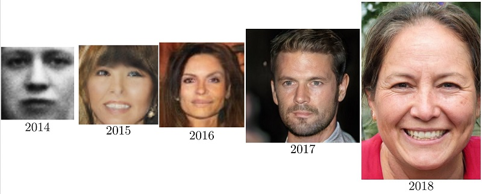

<h3 dir="rtl">
در مورد روش های تولید تصویر توسط هوش مصنوعی (الگوریتم GAN) تحقیق کنید و یک خلاصه را در فرمت مارک داون ایجاد کنید.
</h3>

شبکه عصبی GAN چیست؟
 
شبکه عصبی GAN، یکی دیگر از شبکه‌های عصبی مشهور در یادگیری ماشین است که عمر آن به ده سال نمی‌رسد. شبکه عصبی GAN در سال 2014 توسط Ian Goodfellow و همکارانش پیشنهاد شد (لینک مقاله). شبکه های عصبی GAN مدل‌های مولدی (Generative Models) هستند که داده‌های جدید شبیه داده‌های آموزشی تولید می‌کنند.

شبکه های عصبی GAN می‌توانند تصاویری مانند چهره انسان تولید کنند که کاملا ساختگی هستند. چهره‌هایی که ممکن است در دنیای واقعی وجود نداشته باشند. به تصاویر زیر نگاه کنید، اینها تصاویری هستند که GAN تولی
د کرده و وجود خارجی ندارند. ممکن است بگویید اینها که خیلی واقعی هست، محال است تصویر ساختگی باشد. اتفاقا تصاویر ساختگی است. به چهره افراد نگاه کنید، ببینید می‌توانید جزئیات غیرعادی در چهره‌ها پیدا کنید؟ باید بتوانید
 

Yann Lecun یکی از بزرگان هوش مصنوعی، GAN را جالب‌ترین ایده در 10 سال گذشته یادگیری ماشین توصیف کرده است. همین تعریف از این محقق برجسته نشان می‌دهد که شبکه عصبی GAN چه ایده نابی است. در 6 سال گذشته محققان به موفقیت‌های بزرگی در شبکه GAN رسیده‌اند. در تصویر بالا، تعدادی تصویر چهره باکیفیت به شما نشان دادم. اما از ابتدا تصاویر چهره این اندازه باکیفیت نبود. به تصاویر چهره زیر نگاه کنید. ببینید به مرور چقدر چهره‌ها باکیفیت‌تر و واقعی‌تر شده است. پیشرفت فوق‌العادست!

 

البته، شبکه GAN تنها تصویر چهره تولید نمی‌کند، بلکه امروزه کاربردهای بی‌شماری پیدا کرده است. با جستجو در اینترنت می‌توانید خروجی‌های متنوعی از GAN مشاهده کنید. مانند تولید تصویر حیوانات، نقاشی به سبک نقاشان مشهور، کاریکاتور و غیره.

شبکه های GAN یا دزد و پلیس

یک دزد و پلیس  که به‌ترتیب در نقش مولد و متخاصم ظاهر می‌شوند. البته، ذاتا پلیس متخاصم نیست و دزد متخاصم هست! اما، منظور از اینکه می‌گوییم پلیس متخاصم است، یعنی دشمن مولد (دزد) است.
اما دزد چه می‌کند؟ مطابق انیمیشن بالا، مثلا پول جعلی می‌سازد. وظیفه پلیس هم این است که پول جعلی و واقعی را از هم جدا کند. همین ابتدا تکلیف پلیس را مشخص کنم. پلیس یک دسته‌بند است که در خروجی می‌گوید که پول جعلی/واقعی است. یعنی یک دسته‌بند دوکلاسه داریم.

قبول دارید که دزد و پلیس به‌صورت غیرمستقیم درحال تقویت هم‌دیگر هستند؟ دزد پول جعلی تولید می‌کند و پلیس به‌درستی تشخیص می‌دهد. دزد که شکست خورده، تلاش می‌کند پول جعلی نزدیک‌تر به واقعی تولید کند. بازهم پلیس تشخیص می‌دهد، اما این‌بار متوجه می‌شود که دزدها کمی پیشرفت کرده‌اند. چون، پول‌های جعلی جدید نسبت به قبلی‌ها تفاوت‌هایی دارند. پس توانایی تشخیص پول جعلی/واقعی پلیس افزایش می‌یابد. بازهم دزدِ شکست خورده تلاش می‌کند و پلیس… می‌بینید؟ این جنگ بین دزد و پلیس همین‌طور ادامه می‌یابد. به‌گونه‌ای که دزد درحال تولید پول بسیار باکیفیتی است که ما مردم عادی ممکن است گول بخوریم. اما پلیس آموزش‌دیده می‌تواند تشخیص دهد که جعلی است. پس دزد و پلیس در عین رقابت، درحال یادگیری و پیشرفت هم هستند.

