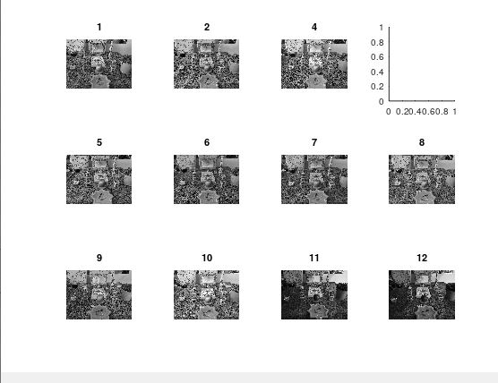

<div dir="rtl">
<h3>فیلتر میانه و میانگین را با یک پنجره ی 7 در 7 روی تصاویر سفره هفت سین خود پیاده سازی کنید. (ابتدا تصویر خاکستری شود).
</h3><br/>
  </div>
  <div dir="rtl">

  
  در ادامه به توضیحات فیلتر میانگین میپردازیم . در کد قرار داده شده در زیر از یک حلقه که برای پیمایش 12 عدد تصویر تهیه شده از سفره هفت سین می باشد استفاده می کنیم سپس تصاویر را وارد نموده و آن ها را به تصاویر خاکستری تبدیل می نماییم در ادامه با استفاده از  نویز نمک و فلفل با کمک  دستورimnoise به تصویر مقداری نویز اضافه می کنیم .

در ادامه با استفاده از دستور medfilt2 به جهت اعمال فیلتر  و یا ازبین بردن نویزهای فلفل نمک استفاده می کنیم .

خروجی در قالب 3 پنجره نمایش داده شده است.
</div><br/>
  
  
  ```
  clc;
close all;
clear;
pkg load image;


for n=1:12
    img=rgb2gray(imread(strcat('./',int2str(n+8),'.jpg')));
    noise_img=imnoise(img,'salt & pepper',0.2);
    filter2=medfilt2(noise_img,[7 7]);
    figure(1);
    subplot(3,4,n),imshow(img),title(n);
    figure(2);
    subplot(3,4,n),imshow(noise_img),title(n);
    figure(3);
    subplot(3,4,n),imshow(filter2),title(n);
end
```


<div align="center">
  <h3>تصاویر بدون نویز</h3><br/>
  
  <h3>تصاویر با نویز</h3><br/>
  
  <h3>تصاویر با اعمال فیلتر</h3><br/>
  
  </div>
  

 
