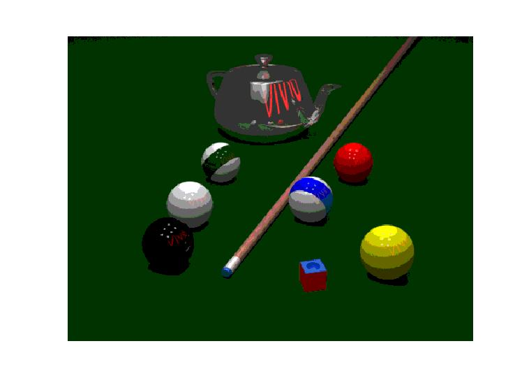

<div dir="rtl">
<h3>تصویر رنگی را به حالت True color ببرید و در تبدیل خود مقدار پیکسل را به مقدار نزدیک آن در True Color میل دهید.</h3><br/>
</div>
<div dir="rtl">
 در ابتدای کار تصویر را بارگزاری کرده و اندازه های ان را استخراج میکنیم و یک ماتریس به اندازه طول و عرض تصویر ایجاد مینماییم.
 </div> <br/>
 
 ```
 clear;
close all;
clc;


img= imread("./Image1.jpg");

size=size(img);
x_img = size(1,1);
y_img = size(1,2);
rresult=zeros(x_img,y_img,3);

result=uint16(result);

figure,imshow(uint8(img)),hold on
```
 <div align="center">
 
 </div>
 <div dir="rtl">
 در کد زیر با پیمایش دو حلقه تودرتو برای هر رنگ، مجموعا 3 بار، بازه 0 تا 255 را به 6 قسمت 0-51-102-153-204-255 تقسیم میکنیم و برای ایجاد دقت بالاتر هربازه را  به 2 بخش تقسیم کردیم، تا عدد بدست آمده را به مرز بازه نزدیک تر کنیم، یعنی اگر به سر بازه نزدیک تر بود، آن را مساوی عدد انتهای بازه می‌گذاریم، اگر نه ، برابر ابتدای بازه قرار میدهیم. و در نهایت تصویر خروجی نمایش داده شده است 
 
 </div>
 
 ```
 for i=1 : x_img
    for j=1 : y_img
        if img(i,j,1)< 25
            result(i,j,1)= 0;
        elseif img(i,j,1) < 76
            result(i,j,1)=51;
        elseif img(i,j,1)< 127
            result(i,j,1)= 102;
        elseif img(i,j,1) < 178
            result(i,j,1)=153;
        elseif img(i,j,1)< 229
            result(i,j,1)= 204;
        else
            result(i,j,1)=255;
        end        
    end
end


for i=1 : x_img
    for j=1 : y_img
        if img(i,j,2)< 25
            result(i,j,2)= 0;
        elseif img(i,j,2) < 76
            result(i,j,2)=51;
        elseif img(i,j,2)< 127
            result(i,j,2)= 102;
        elseif img(i,j,2) < 178
            result(i,j,2)=153;
        elseif img(i,j,2)< 229
            result(i,j,2)= 204;
        else
            result(i,j,2)=255;
        end        
    end
end


for i=1 : x_img
    for j=1 : y_img
        if img(i,j,3)< 25
            result(i,j,3)= 0;
        elseif img(i,j,3) < 76
            result(i,j,3)=51;
        elseif img(i,j,3)< 127
            result(i,j,3)= 102;
        elseif img(i,j,3) < 178
            result(i,j,3)=153;
        elseif img(i,j,3)< 229
            result(i,j,3)= 204;
        else
            result(i,j,3)=255;
        end        
    end
end
figure, imshow(uint8(result));
```
 
  <h3 dir="rtl">خروجی</h3>

 
 <div align="center">
 
 </div>
  


