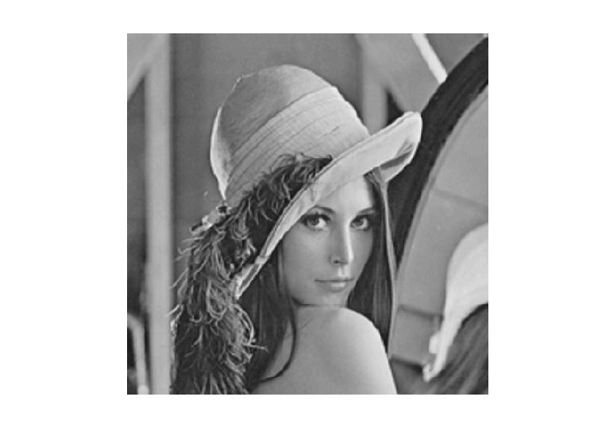

<div dir="rtl" align="justify">
<h5>مخفی کردن متن در تصاویر و اعمال تغییرات بر روی هیستوگرام تصاویر | یک تصویر به عنوان ورودی اصلی در نظر گرفته شود. در تصویر ورودی، 8 Bit plane استخراج گردد و خروجی آن نمایش داده شود. یک تصویر شامل یک بیت شعر را به عنوان ورودی دوم لحاظ کنید. تصویر ورودی دوم را در تصویر اصلی مخفی کنید و روش مخفی کردن خود را توضیح دهید. در صورت تفاوت ابعاد دو تصویر، چه عملی باید انجام بگیرد؟ ایده شما برای کاهش حجم تصاویر ورودی براساس Bit plane چیست؟ در صورت امکان¬پذیر بودن این امر، تصویر اصلی ورودی را کاهش حجم دهید. هیستوگرام تصویر اصلی و تصویر دوم را نمایش دهید. دلیل تفاوت هیستوگرام¬های خروجی چیست؟ آیا امکان افزایش کنتراست در دو تصویر وجود دارد؟ هیستوگرام دو تصویر را هموارسازی کرده و خروجی را نمایش دهید. دو تصویر به عنوان نمونه در ضمیمه این فایل قرار داده شده است. در صورتی که سوالی در مورد هر بند از این پروژه داشته باشید می¬توانید سوالات خود را از طریق کانال تلگرامی بپرسید. (در پوشه ی کلاس با نام Lenna.png و text.jpg)</h5><br/>
</div>
<div dir="rtl">
 در ابتدا کد های مربوط به پاکسازی حافظه و متغیر های در حال اجرا قرار داده شده است و در ادامه دو تصویر خواسته شده فراخوانی شده اند و به فرمت خاکستری در امده اند. 
 </div> <br/>
 
 ```
 clear;
close all;
clc;

img=rgb2gray(imread("./Lenna.png"));
figure,imshow(uint8(img)),hold on
text_img=im2bw(imread("./text.jpg"));
figure, imshow(text_img);

```
<h3>خروجی قسمت اول </h3>
 
 <div align="center">
 
 </div>
 
<div dir="rtl">
 در ادامه سایز دو تصویر دریافت شده و در 4 متغیر قرار داده شده است و در ادامه تغییر سایز داده شده است . به این صورت با استفاده از یک شرط بررسی میشود که کدام تصویر کوچک تر است و ابعاد تصویر بزرگ را به اندازه تصویر کوچک تغییر سایز میدهد.
 </div>
 
 ```
 [size_x, size_y] = size(img);
[size_w, size_z] = size(text_img);

if size_x<size_w && size_y<size_z
    text_img = imresize(text_img, [size_x ,size_y]);
    img = imresize(img, [size_x, size_y]);
else
    img = imresize(img, [size_w ,size_z]);
    text_img = imresize(text_img, [size_w, size_z]);
 end
 ```
 
 <div dir="rtl">
 در  این قسمت تمامی bit plan های تصویر را استخراج خواهیم کرد در این بخش لازم است مقادیر intensity موجود در پیکسل ها که بر مینای 10 است را به صورت double در می آوریم و با تقسیم عدد بر عدد مبنای آن پایه به صورت زیر عمل میکنیم برای مثال برای بیت پلن چهارم ان را بر 4^2 تقسیم کرده و باقی مانده آن را بر 2 حساب میکنیم   
 </div>
 
 ```
 bitPlane_1 = text_img;
bitPlane_2 = mod(floor(double(img)/2), 2);
bitPlane_3 = mod(floor(double(img)/4), 2);
bitPlane_4 = mod(floor(double(img)/8), 2);
bitPlane_5 = mod(floor(double(img)/16), 2);
bitPlane_6 = mod(floor(double(img)/32), 2);
bitPlane_7 = mod(floor(double(img)/64), 2);
bitPlane_8 = mod(floor(double(img)/128), 2);
```
  
<div dir="rtl">
به جهت دست آوردن تصویر اصلی، تمامی bit Plane هایی که در قسمت قبل بدست آوردیم را به روش معکوس باهم جمع می‌کنیم و آن را در متغییری تحت عنوان pic ذخیره می‌کنیم:
</div>

```
pic = (2 * (2 * (2 * (2 * (2 * (2 * (2 * bitPlane_8 + bitPlane_7) + bitPlane_6) + bitPlane_5) + bitPlane_4) + bitPlane_3) + bitPlane_2) + bitPlane_1);
```
<div dir="rtl">
 در این بخش به وسیله subplot تمامی تصاویر bitPlane ها و تصویر اصلی و تصویری که دوباره ایجاد کرده ایم  را در یک plot نمایش داده که خروجی ان در ادامه قرار داده شده است .


</div>

```
figure, subplot(2, 5, 1);
imshow(img);
title('Original Image');

subplot(2, 5, 2);
imshow(bitPlane_1);
title('Bit Plane 1');

subplot(2, 5, 3);
imshow(bitPlane_2);
title('Bit Plane 2');

subplot(2, 5, 4);
imshow(bitPlane_3);
title('Bit Plane 3');

subplot(2, 5, 5);
imshow(bitPlane_4);
title('Bit Plane 4');

subplot(2, 5, 6);
imshow(bitPlane_5);
title('Bit Plane 5');

subplot(2, 5, 7);
imshow(bitPlane_6);
title('Bit Plane 6');

subplot(2, 5, 8);
imshow(bitPlane_7);
title('Bit Plane 7');

subplot(2, 5, 9);
imshow(bitPlane_8);
title('Bit Plane 8');

subplot(2, 5, 10);
imshow(uint8(pic));
title('Recombined Image');
```

