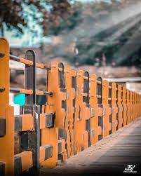

<div dir="rtl">
<h3>برنامه ای بنویسید که تمام پیکسل های تصویر را 50 درجه روشن تر کند.
</h3><br/>
  </div>
  <div dir="rtl">

  
 در کد زیر ابتدا تصویر ورودی فراخوانی شده و تبدیل به حالت خاکستری شده است .
  </div>

  ```
  clc;
clear all;
close all;

img = imread('./inputImage.jpg');
img =rgb2gray(img);
figure,imshow(img);
```
<div dir="rtl">
  تصویر اصلی ورودی: 
  
 <br/>
  <p align="center">

</p><br/>
  خروجی برنامه فوق : 
  
 <br/>
  <p align="center">

</p><br/>
</div>

<div dir="rtl">
 در ادامه به تمام پیکسل های موجود در تصویر 50 درجه روشن شده
</div><br/>

```
[i,j]=size(img);

for i = 1: i
    for j = 1: j
        img(i,j) = img(i,j) + 50;
    end
end

imshow(img);
  ```
<div dir="rtl">

<li>
 تصویر خروجی :  
</li><br/>
<p align="center">

</p>


  

</div>
