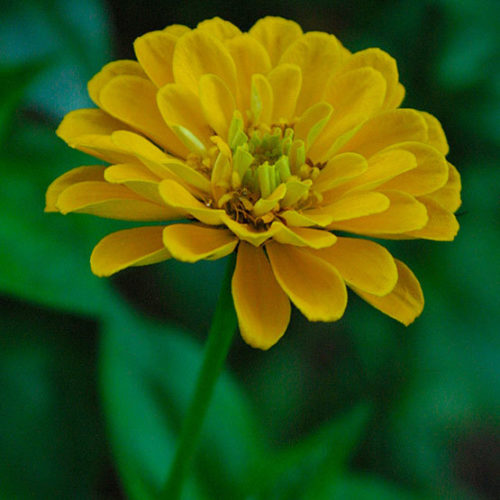
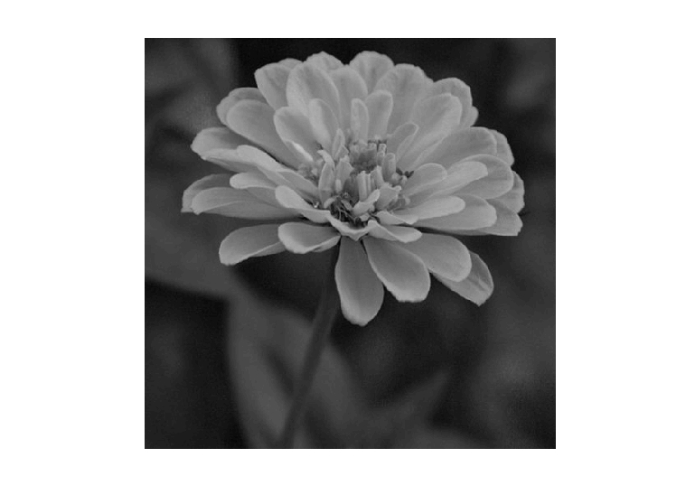

<div dir="rtl">
<h3>برنامه ای بنویسید که با فیلتر همسایگی 4 گانه کار کند (بالا، پایین، چپ، راست) و پیکسل مرکزی را از حاصل جذر همسایه ها تغییر مقدار دهد.
</h3><br/>
  </div>
  <div dir="rtl">

  
 در کد زیر ابتدا تصویر ورودی فراخوانی شده و تبدیل به حالت خاکستری شده است .
  </div>

  ```
clc;
clear;
close all;

img = imread('./inputImage3.jpg') ;
img = rgb2gray(img) ;
figure, imshow(uint8(img));
```
<div dir="rtl">
  تصویر اصلی ورودی: 
  
 <br/>
  <p align="center">

</p><br/>
  خروجی برنامه فوق : 
  
 <br/>
  <p align="center">

</p><br/>
</div>

<div dir="rtl" align="justify">
در ادامه سایز تصویر به صورت آرایه دریافت شده و به جهت استفاده از تابع sqrtکه عملیات جذر را انجام میدهد لازم است تا تصویر به را با کمک تابع double از حالت unit 8 به double‌ تبديل كنيم در ادامه با کمک حلثه for  قرار داده شده تصویر را پیمایش میکنیم و پیکسل های چپ ، راست، بالا و پایین را دریافت کرده تا به همسایه های موجود دسترسی داشته باشیم و برای هر 4 پیکسل نام برده در فوق عملیات  کجذر را  انجام داده ودر نهایت تصویر را در خروجی نمایش میدهیم و برای نمایش مجددا تصویر را از حالت double به حالت unit 8 میبریم.
</div><br/>

```
[k,l]=size(img);
img_sqr = double(img);
for i = 2: k-1
    for j = 2: l-1
       img_sqr(i,j)= sqrt(img_sqr(i+1,j))+sqrt(img_sqr(i-1,j))+sqrt(img_sqr(i,j-1))+sqrt(img_sqr(i,j+1));     
    end
end
figure, imshow(uint8(img));
  ```
<div dir="rtl">

<li>
 تصویر خروجی :  
</li><br/>
<p align="center">

</p>
</div>
