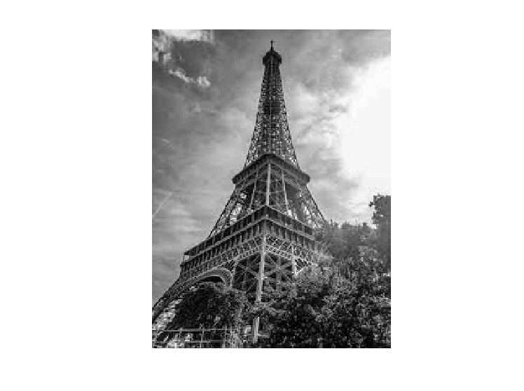

<div dir="rtl">
<h3>یک تصویر را از تصاویر benchmark بخوانید و سعی کنید در مرکز تصویر یک دایره ایجاد کنید</h3><br/>
  </div>
  <div dir="rtl">
در ابتدا تصویری از ورودی فراخوانی شده سپس آنرا به حالت خاکستری در می آوریم در ادامه ابعاد تصویر را خانواده و با تقسیم طول و عرض بر 2 مرکز تصویر را محاسبه کرده و در نهایت تصویر را نمایش میدهیم.
  </div><br/>

  ```
clc;
close all;
clear;

img = imread("./inputImage.jpg");
img = rgb2gray(img);
[i,j] = size(img);
x = j/2;
y = i/2;
imshow(img); 
```
<div dir="rtl">
<li>
 تصویر ورودی اصلی  :  
</li><br/>
  </div>
<p align="center">

</p>
<div dir="rtl">
<li>
 تصویر خروجی :  
</li><br/>
  </div>
<p align="center">

</p>
<div dir="rtl">
در ادامه مقدار شعاع دایره مورد نظر 70 در نظر گرفته شده و در متغیری به نام r قرار میگرد وزاویه پی را   در متغیری به نام theta قرار میدهیم  با این عمل دو نیمه ی بالایی و پایینی تصویر به صورت پیوسته محاسبه شده تا در نهایت دایره ای با مشخصات و شعاع وارد شده شکل بگیرد در این بخش با استفاده از hold onحالت های جاری را نگهداری میکنیم  و با تنظیم رنگ دایره بر روی قرمز و ضخامت خط دایره بر روی 5 دایره به طور کامل ایجاد میگردد و در نهایت حالت جاری که در فوق به نگهداری آن پرداختیم در حالت off یا خاموش قرار میگرد. در ادامه خروجی برنامه قرار داده شده است.
  </div>

  <br/>

```
r = 70;
hold on;
theta = 0 : (2 * pi / 10000) : (2 * pi);
axis_x = r * cos(theta) + x;
axis_y = r * sin(theta) + y;
k = ishold;
plot(axis_x, axis_y, 'r-', 'LineWidth', 5);
hold off;
```

<p align="center">

</p>
</div>
</div>
