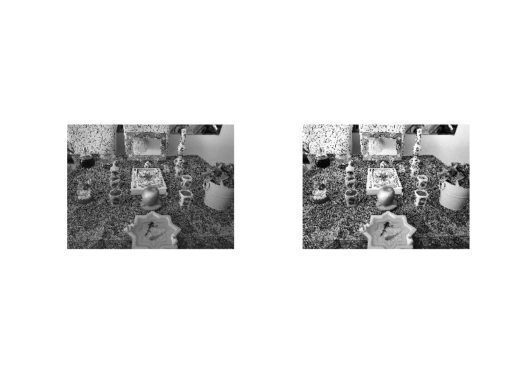
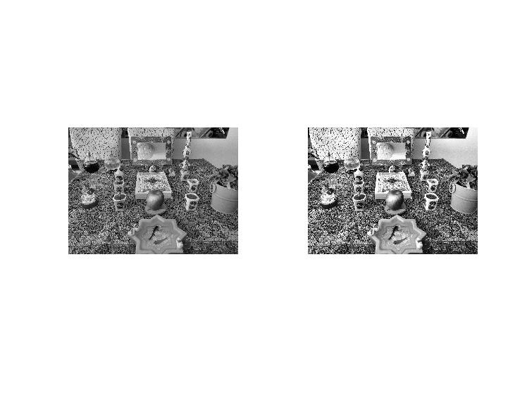
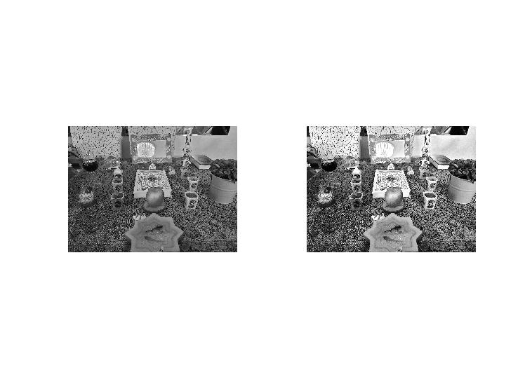
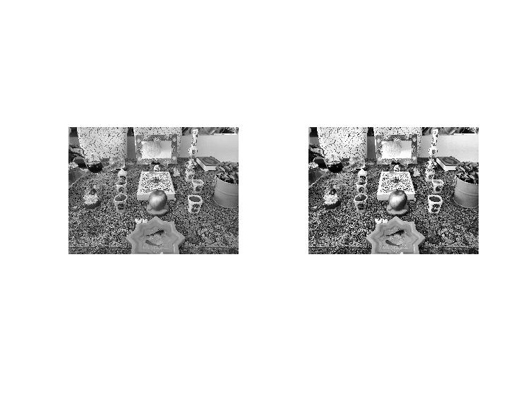
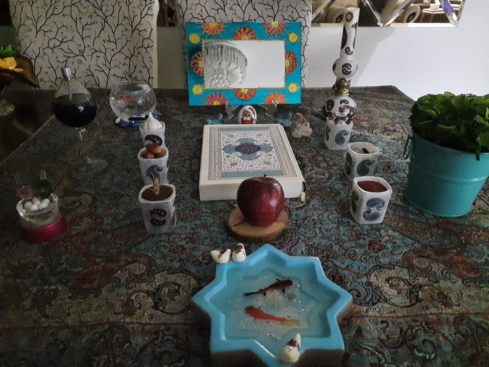
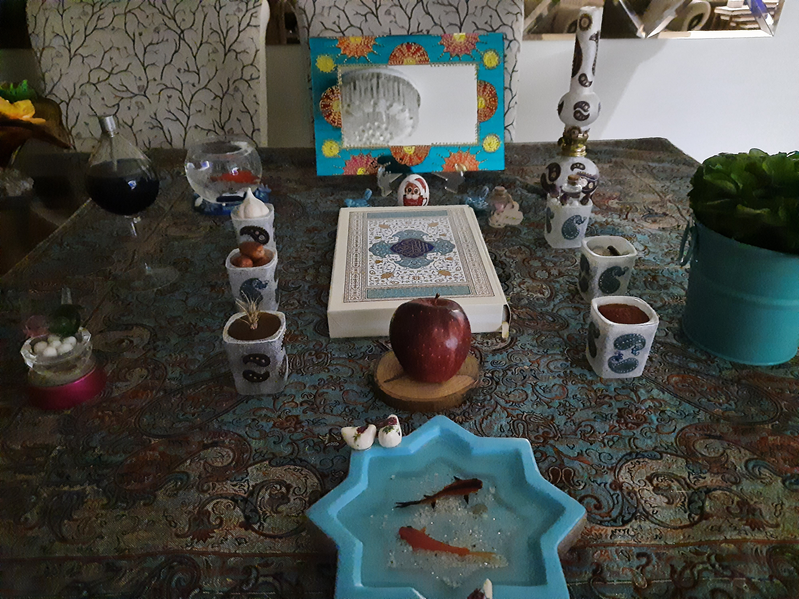

<div dir="rtl">
<h3>روی تصاویر سفره هفت سین خود عملیات بهینه سازی هیستوگرام را انجام دهید و خروجی هر یک را در کنار ورودی اصلی آن قرار دهید. (ابتدا تصویر خاکستری شود.)</h3><br/>
</div>
<div dir="rtl">
  برای این کار ابتدا همانطور که در صورت سوال نیز ذکر شده است تصاویر را در حالت خاکستری قرار میدهیم.
  </div> <br/>
  
  ```
  clc;
close all;
clear;


img_1 = rgb2gray(imread("9.jpg"));
img_2 = rgb2gray(imread("10.jpg"));
img_3 = rgb2gray(imread("11.jpg"));
img_4 = rgb2gray(imread("12.jpg"));
img_5 = rgb2gray(imread("13.jpg"));
img_6 = rgb2gray(imread("14.jpg"));
img_7 = rgb2gray(imread("15.jpg"));
img_8 = rgb2gray(imread("16.jpg"));
img_9 = rgb2gray(imread("17.jpg"));
img_10 = rgb2gray(imread("18.jpg"));
img_11 = rgb2gray(imread("19.jpg"));
img_12 = rgb2gray(imread("20.jpg"));
img_13 = rgb2gray(imread("21.jpg"));
```
<div dir="rtl">
 در ادامه بهینه سازی هیستوگرام را بر روی تصویراعمال نموده و آنها را در قالب تصویر جدید ذخیره می کنیم و نتیجه به شکل زیر خواهد بود  
  </div><br/>
  
  
  ```
  figure;
subplot(1,2,1);imshow(img_1);
subplot(1,2,2);imshow(histeq(img_1));

figure;
subplot(1,2,1);imshow(img_2);
subplot(1,2,2);imshow(histeq(img_2));

figure;
subplot(1,2,1);imshow(img_3);
subplot(1,2,2);imshow(histeq(img_2));

figure;
subplot(1,2,1);imshow(img_4);
subplot(1,2,2);imshow(histeq(img_4));


figure;
subplot(1,2,1);imshow(img_5);
subplot(1,2,2);imshow(histeq(img_5));


figure;
subplot(1,2,1);imshow(img_6);
subplot(1,2,2);imshow(histeq(img_6));


figure;
subplot(1,2,1);imshow(img_7);
subplot(1,2,2);imshow(histeq(img_7));


figure;
subplot(1,2,1);imshow(img_8);
subplot(1,2,2);imshow(histeq(img_8));


figure;
subplot(1,2,1);imshow(img_9);
subplot(1,2,2);imshow(histeq(img_9));


figure;
subplot(1,2,1);imshow(img_10);
subplot(1,2,2);imshow(histeq(img_10));

figure;
subplot(1,2,1);imshow(img_11);
subplot(1,2,2);imshow(histeq(img_11));

figure;
subplot(1,2,1);imshow(img_12);
subplot(1,2,2);imshow(histeq(img_12));

figure;
subplot(1,2,1);imshow(img_13);
subplot(1,2,2);imshow(histeq(img_13));

```

<table align="center">
  <tr align="center">
   <td>تصاویر اصلی </td>
  <td>خروجی ها</td>
 
  </tr>
  <tr>
    <td></td>
    <td></td>
  </tr>
    <tr>
    <td></td>
    <td></td>
  </tr>
    <tr>
    <td></td>
    <td></td>
  </tr>
    <tr>
    <td></td>
    <td></td>
  </tr>
    <tr>
    <td></td>
    <td></td>
  </tr>
    <tr>
    <td></td>
    <td></td>
  </tr>
    <tr>
    <td></td>
    <td></td>
  </tr>
    <tr>
    <td></td>
    <td></td>
  </tr>
    <tr>
    <td></td>
    <td></td>
  </tr>
    <tr>
    <td></td>
    <td></td>
  </tr>
    <tr>
    <td></td>
    <td></td>
  </tr>
    <tr>
    <td></td>
    <td></td>
  </tr>
    <tr>
    <td></td>
    <td></td>
  </tr>
  </table>

