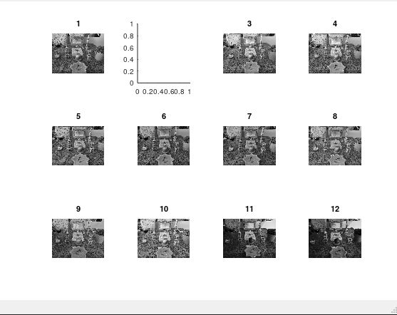

<div dir="rtl">
<h3>فیلتر میانه و میانگین را با یک پنجره ی 7 در 7 روی تصاویر سفره هفت سین خود پیاده سازی کنید. (ابتدا تصویر خاکستری شود.)</h3><br/>
  </div>
  <div dir="rtl">
  در ادامه به توضیحات فیلتر میانگین میپردازیم . در کد قرار داده شده در زیر از یک حلقه که برای پیمایش 12 عدد تصویر تهیه شده از سفره هفت سین می باشد استفاده می کنیم سپس تصاویر را وارد نموده و آن ها را به تصاویر خاکستری تبدیل می نماییم در ادامه از دستور fspecial به جهت ایجاد یک فیلتر استفاده میکنیم که پارامتر اول آن average می باشد که برای ساخت فیلتر میانگین می توان از آن استفاده نمود .و اندازه پارامتر دوم را به عنوان اندازه پنجره 7 در 7 در نظر گرفته و در متغیری با نام k قرار میدهیم و بااستفاده از فانکشن imfilter فیلتر را برروی تصاویر سطح خاکستری اعمال کرده سپس تصاویر را بااستفاده از subplot در قالب دو پنجره نمایش می دهیم که خروجی آن به شکل زیر است.
  </div><br/>

  ```
clc;
close all;
clear;


for n=1:12
    img=rgb2gray(imread(strcat('./',int2str(n+8),'.jpg')));
    k=fspecial('average',[7 7]);
    mean_filter=imfilter(img,k);
    figure(1);
    subplot(3,4,n),imshow(img),title(n);
    figure(2);
    subplot(3,4,n),imshow(mean_filter),title(n);
end 
```
<div dir="rtl">
  <div align="center">
  
    <h3>خروجی پس از اعمال فیلتر </h3><br/>
  
  </div>
</div>
