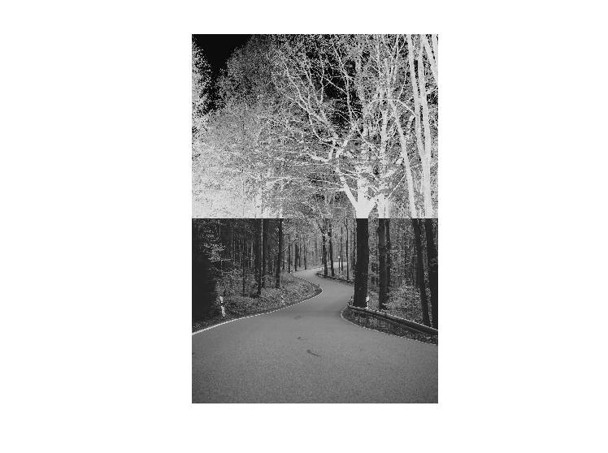

<div dir="rtl">
<h3>برنامه ای بنویسید که نیمه ی بالایی یک تصویر را نگاتیو کند.</h3><br/>
  </div>
  <div dir="rtl">

  
 در کد زیر ابتدا تصویر وروودی فراخوانی شده و تبدیل به حالت خاکستری شده است .
  </div>

  ```
  clc;
clear all;
close all;

img = imread('./inputImage.jpg');
img =rgb2gray(img);
figure,imshow(img);
```
<div dir="rtl">
  تصویر اصلی ورودی : 
  
 <br/>
  <p align="center">

</p><br/>
  خروجی کد فوق : 
  
 <br/>
  <p align="center">

</p><br/>
  در ادامه سایز تصویر به صورت طول و عرض دریافت شده و نیمی از تصویر به صورت عمودی دریافت شده است
</div><br/>
  
```
[k,l]=size(img);
k=k/2;
```
<div dir="rtl">
  در ادامه به اندازه کل پیکسل های عرضی تصویر و نیمی از تصویر به صورت طولی که در کد فوق دریافت شد ، حلقه هایی ایجاد گردیده و مقدار 255 از آنها کم شده است به این ترتیب نیمی از تصویر به صورت نگاتیو شده و در نهایت تصویر نمایش داده شده است.
</div><br/>

```
for i=1:k
    for j=1:l
        img(i,j)=255-img(i,j);
    end 
end 

imshow(img);
  ```
<div dir="rtl">

<li>
 تصویر خروجی :  
</li><br/>
<p align="center">

</p>


  

</div>
