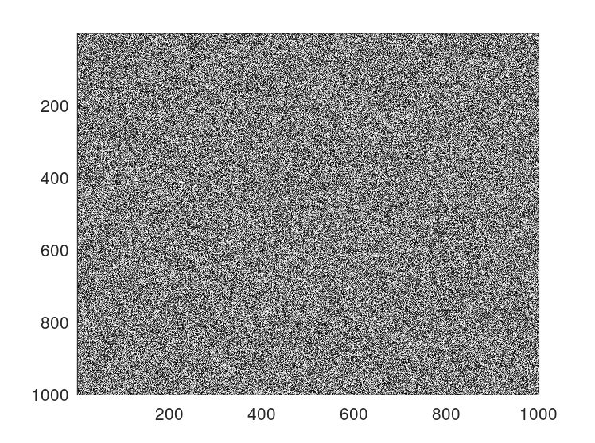

<div dir="rtl">
<h3>یک تصویر 1000 در 1000 ایجاد کنید که مقدار هر پیکسل آن یک عدد تصادفی باشد.</h3><br/>
  </div>
  <div dir="rtl">
در ابتدا با استفاده از تابع randi از 0 تا 255 در فضای 1000 در 1000 اعداد تصادفی ایجاد شده و در متغیر img قرار داده شده است
  و به دلیل اینکه تصویر مقداری بین 0 تا 255 میتواند داشته باشد انرا در فرمت uint8 برده و در نهایت با استفاده از تابع colormap رنگ نمایش خروجی را به خاکستری تغییر داده ایم.
  </div><br/>

  ```
clc;
clear all;
close all;

img = randi(255,1000,1000);
imagesc(img);
colormap(gray);
```

<div dir="rtl">
<li>
 تصویر خروجی :  
</li><br/>
  </div>
<p align="center">

</p>
   <div dir="rtl">

<li>
  نکته : 
   قرار داده نشود در صورتی که کد زیر قرار داده نشود خروجی همچون تصویر زیرین خواهد بود :
   </li><br/>
  </div>
   

  <div>

   ```
    colormap(gray);
  ```
<p align="center">

</p>
</div>
</div>
